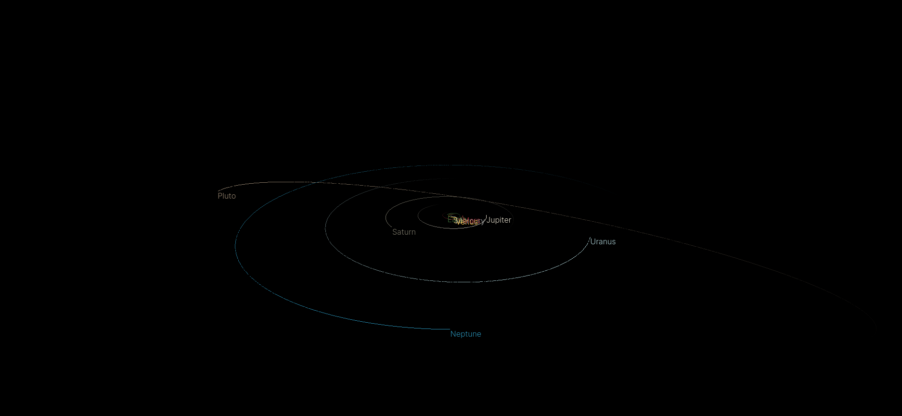
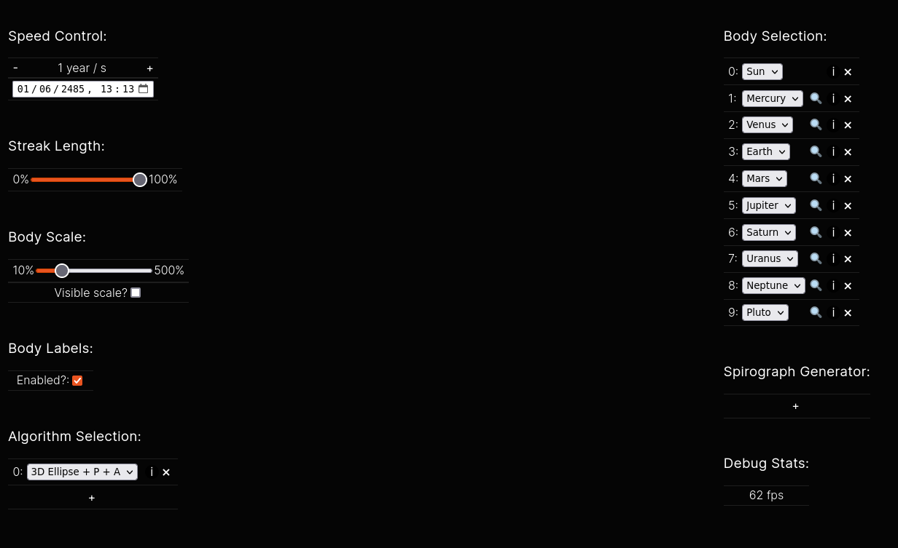
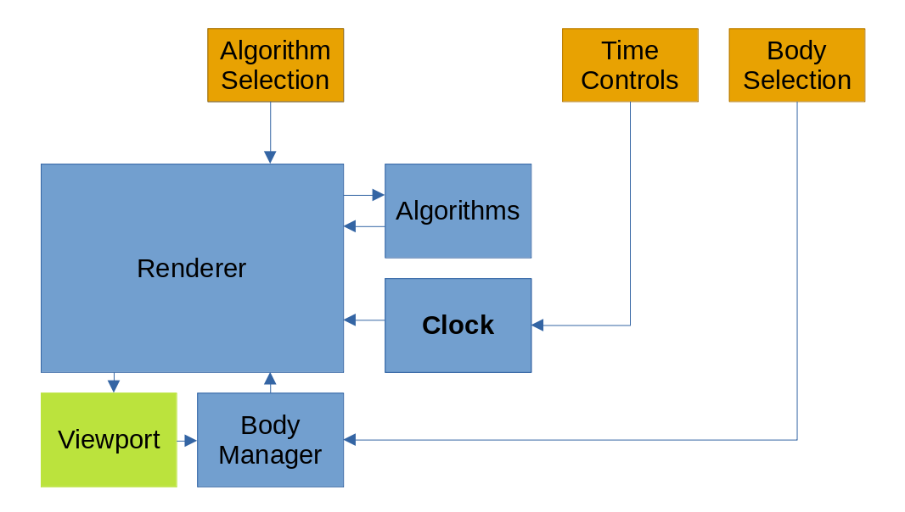
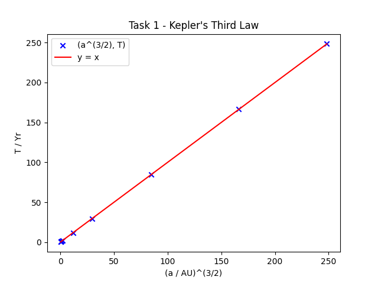
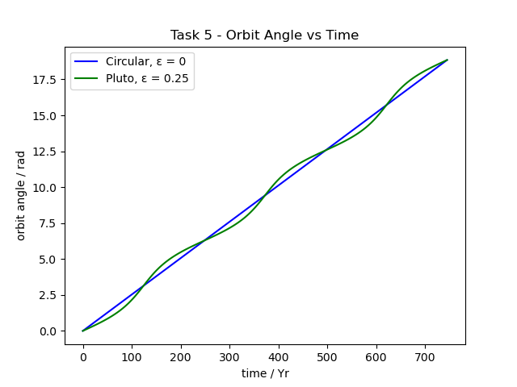

# OrbY
**Orb**ital Displa**y** 
A solar system viewer written in [three.js](https://github.com/mrdoob/three.js/)

## Planets
Currently, the following planets are simulated:
* The Sun
* Mercury
* Venus
* Earth
* Mars
* Jupiter
* Saturn
* Uranus
* Neptune
* Pluto

## Screenshots
Default view:

Controls:

## Renderer model

## Graphs
Task 1:

Task 5:

